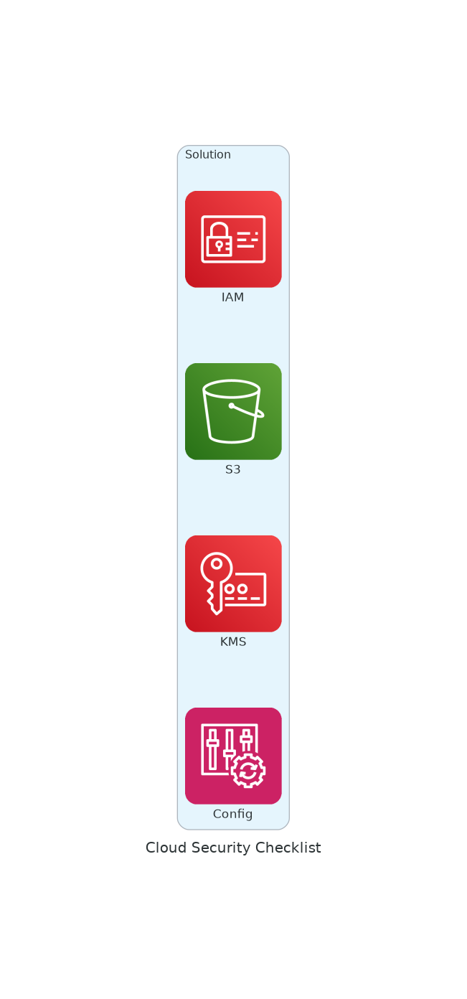

# Cloud Security List

## Architecture

> A curated list of cloud security tools, vendors, and resources.

Cloud security engineers are notoriously overworked and under-resourced. This list has links to tools, frameworks and resources to make their lives easier.

## 🌐 [Browse the interactive site →](https://someengineering.github.io/cloud-security-list/)

## Contributing

See [CONTRIBUTING.md](CONTRIBUTING.md) for guidelines on adding new entries.

---

# Threat Research

- [Cloud Security Alliance Research](https://cloudsecurityalliance.org/research/)
- [Datadog Security Labs](https://securitylabs.datadoghq.com/)
- [Elastic Security Labs](https://www.elastic.co/security-labs)
- [Google Project Zero](https://googleprojectzero.blogspot.com/)
- [Microsoft Security Response Center](https://www.microsoft.com/en-us/msrc)
- [Orca Research Pod](https://orca.security/about/orca-research-pod/)
- [Rapid7 Research](https://www.rapid7.com/research/)
- [Sysdig Threat Research](https://sysdig.com/threat-research/)
- [Team Nautilus by Aqua Security](https://www.aquasec.com/research/)
- [Unit 42 by Palo Alto Networks](https://unit42.paloaltonetworks.com/)
- [Wiz Cloud Threat Landscape](https://threats.wiz.io/)

# Security Vendors

## Publicly Listed Vendors

These are vendors with publicly traded stocks. Links: website, LinkedIn, stock ticker.

- [Check Point](https://www.checkpoint.com/) | [LinkedIn](https://www.linkedin.com/company/check-point-software-technologies/about/) | [CHKP](https://finance.yahoo.com/quote/CHKP)
- [Cisco](https://www-cloud.cisco.com/site/us/en/products/security/index.html) | [LinkedIn](https://www.linkedin.com/company/cisco/) | [CSCO](https://finance.yahoo.com/quote/CSCO)
- [CloudFlare](https://www.cloudflare.com) | [LinkedIn](https://www.linkedin.com/company/cloudflare/) | [NET](https://finance.yahoo.com/quote/NET)
- [CrowdStrike](https://www.crowdstrike.com/) | [LinkedIn](https://www.linkedin.com/company/crowdstrike/) | [CRWD](https://finance.yahoo.com/quote/CRWD)
- [CyberArk](https://www.cyberark.com) | [LinkedIn](https://www.linkedin.com/company/cyber-ark-software/) | [CYBR](https://finance.yahoo.com/quote/CYBR)
- [Datadog](https://www.datadoghq.com/) | [LinkedIn](https://www.linkedin.com/company/datadog/about/) | [DDOG](https://finance.yahoo.com/quote/DDOG)
- [Fortinet](https://www.fortinet.com) | [LinkedIn](https://www.linkedin.com/company/fortinet/) | [FTNT](https://finance.yahoo.com/quote/FTNT)
- [Palo Alto Networks](https://www.paloaltonetworks.com/) | [LinkedIn](https://www.linkedin.com/company/palo-alto-networks) | [PANW](https://finance.yahoo.com/quote/PANW)
- [Qualys](https://www.qualys.com/) | [LinkedIn](https://www.linkedin.com/company/qualys) | [QLYS](https://finance.yahoo.com/quote/QLYS)
- [Radware](https://www.radware.com/) | [LinkedIn](https://www.linkedin.com/company/radware/about/) | [RDWR](https://finance.yahoo.com/quote/RDWR)
- [SentinelOne](https://www.sentinelone.com/) | [LinkedIn](https://www.linkedin.com/company/sentinelone) | [S](https://finance.yahoo.com/quote/S)
- [Tenable](https://www.tenable.com/) | [LinkedIn](https://www.linkedin.com/company/tenableinc) | [TENB](https://finance.yahoo.com/quote/TENB)
- [Varonis](https://www.varonis.com/) | [LinkedIn](https://www.linkedin.com/company/varonis/) | [VRNS](https://finance.yahoo.com/quote/VRNS)
- [Zscaler](https://www.zscaler.com/) | [LinkedIn](https://www.linkedin.com/company/zscaler/) | [ZS](https://finance.yahoo.com/quote/ZS)

### Formerly Listed

- [HashiCorp](https://www.hashicorp.com) | [LinkedIn](https://www.linkedin.com/company/hashicorp/) | [HCP](https://finance.yahoo.com/quote/HCP)
- [Splunk](https://www.splunk.com/) | [LinkedIn](https://www.linkedin.com/company/splunk/) | [SPLK](https://finance.yahoo.com/quote/SPLK)

## Private Vendors

Venture-funded companies

- [AccuKnox](https://www.accuknox.com/) | [LinkedIn](https://www.linkedin.com/company/accuknox/) | [Crunchbase](https://www.crunchbase.com/organization/accuknox)
- [Aikido](https://www.aikido.dev/) | [LinkedIn](https://www.linkedin.com/company/aikido-security/) | [Crunchbase](https://www.crunchbase.com/organization/aikido-security)
- [Aqua Security](https://www.aquasec.com/) | [LinkedIn](https://www.linkedin.com/company/aquasecteam/) | [Crunchbase](https://www.crunchbase.com/organization/aquasecurity)
- [ARMO](https://www.armosec.io/) | [LinkedIn](https://www.linkedin.com/company/armosec/) | [Crunchbase](https://www.crunchbase.com/organization/cyber-armor)
- [Arnica](https://www.arnica.io/) | [LinkedIn](https://www.linkedin.com/company/arnica-io/) | [Crunchbase](https://www.crunchbase.com/organization/arnica-io)
- [Astrix](https://astrix.security) | [LinkedIn](https://www.linkedin.com/company/astrix-security/) | [Crunchbase](https://www.crunchbase.com/organization/astrix-security)
- [Avalor](https://www.avalor.io) | [LinkedIn](https://www.linkedin.com/company/avalorsec/) | [Crunchbase](https://www.crunchbase.com/organization/avalor-72e5)
- [Bright Security](https://brightsec.com/) | [LinkedIn](https://www.linkedin.com/company/neuralegion/) | [Crunchbase](https://www.crunchbase.com/organization/neuralegion)
- [Chainloop](https://chainloop.dev) | [LinkedIn](https://www.linkedin.com/company/chainloop-dev) | [Crunchbase](https://www.crunchbase.com/organization/chainloop)
- [Clutch](https://www.clutch.security/) | [LinkedIn](https://www.linkedin.com/company/clutch-security/) | [Crunchbase](https://www.crunchbase.com/organization/clutch-security)
- [Coalfire](https://www.coalfire.com) | [LinkedIn](https://www.linkedin.com/company/coalfire/) | [Crunchbase](https://www.crunchbase.com/organization/coalfire-system)
- [Curity](https://curity.io/) | [LinkedIn](https://www.linkedin.com/company/curity/) | [Crunchbase](https://www.crunchbase.com/organization/curity)
- [Cyera](https://www.cyera.io/) | [LinkedIn](https://www.linkedin.com/company/cyera/) | [Crunchbase](https://www.crunchbase.com/organization/cyera)
- [Cyscale](https://cyscale.com) | [LinkedIn](https://www.linkedin.com/company/cyscale/) | [Crunchbase](https://www.crunchbase.com/organization/cyscale)
- [Cyware](https://cyware.com/) | [LinkedIn](https://www.linkedin.com/company/cyware/) | [Crunchbase](https://www.crunchbase.com/organization/cyware)
- [Darktrace](https://darktrace.com/) | [LinkedIn](https://www.linkedin.com/company/darktrace/) | [Crunchbase](https://www.crunchbase.com/organization/darktrace)
- [Deepfence](https://www.deepfence.io/) | [LinkedIn](https://www.linkedin.com/company/deepfence-inc) | [Crunchbase](https://www.crunchbase.com/organization/deepfence)
- [Deepsource](https://deepsource.com) | [LinkedIn](https://www.linkedin.com/company/deepsourcelabs) | [Crunchbase](https://www.crunchbase.com/organization/deepsource)
- [Endor Labs](https://www.endorlabs.com/) | [LinkedIn](https://www.linkedin.com/company/endorlabs/) | [Crunchbase](https://www.crunchbase.com/organization/endor-labs)
- [Entro](https://entro.security) | [LinkedIn](https://www.linkedin.com/company/entro-security/) | [Crunchbase](https://www.crunchbase.com/organization/entro-cf4f)
- [Eureka Security](https://www.eureka.security/) | [LinkedIn](https://www.linkedin.com/company/eureka-security/) | [Crunchbase](https://www.crunchbase.com/organization/eureka-security)
- [GitGuardian](https://www.gitguardian.com/) | [LinkedIn](https://www.linkedin.com/company/gitguardian/) | [Crunchbase](https://www.crunchbase.com/organization/gitguardian)
- [Grip Security](https://www.grip.security/) | [LinkedIn](https://www.linkedin.com/company/grip-security/) | [Crunchbase](https://www.crunchbase.com/organization/grip-security)
- [Hunters](https://www.hunters.security/) | [LinkedIn](https://www.linkedin.com/company/hunters-ai/) | [Crunchbase](https://www.crunchbase.com/organization/hunters-ai)
- [JupiterOne](https://www.jupiterone.com/) | [LinkedIn](https://www.linkedin.com/company/jupiterone/) | [Crunchbase](https://www.crunchbase.com/organization/jupiterone)
- [Kloudle](https://kloudle.com/) | [LinkedIn](https://www.linkedin.com/company/kloudle/) | [Crunchbase](https://www.crunchbase.com/organization/kloudle)
- [Lacework](https://www.lacework.com/) | [LinkedIn](https://www.linkedin.com/company/lacework/) | [Crunchbase](https://www.crunchbase.com/organization/lacework)
- [Lightlytics](https://www.lightlytics.com/) | [LinkedIn](https://www.linkedin.com/company/lightlytics/) | [Crunchbase](https://www.crunchbase.com/organization/lightlytics)
- [Lineaje](https://www.lineaje.dev/) | [LinkedIn](https://www.linkedin.com/company/lineaje/) | [Crunchbase](https://www.crunchbase.com/organization/lineaje)
- [Matano](https://matanosecurity.com/) | [LinkedIn](https://www.linkedin.com/company/matanolabs/) | [Crunchbase](https://www.crunchbase.com/organization/matano)
- [Metomic](https://metomic.io) | [LinkedIn](https://www.linkedin.com/company/metomic/) | [Crunchbase](https://www.crunchbase.com/organization/metomic)
- [Netwrix](https://www.netwrix.com/) | [LinkedIn](https://www.linkedin.com/company/netwrix-corporation/) | [Crunchbase](https://www.crunchbase.com/organization/netwrix)
- [Normalyze](https://normalyze.ai/) | [LinkedIn](https://www.linkedin.com/company/normalyze/) | [Crunchbase](https://www.crunchbase.com/organization/normalyze)
- [Noq](https://noq-0.webflow.io/) | [LinkedIn](https://www.linkedin.com/company/noq-software/) | [Crunchbase](https://www.crunchbase.com/organization/noq-software)
- [OASIS Security](https://www.oasis.security/) | [LinkedIn](https://www.linkedin.com/company/non-human-identity-management-oasis/) | [Crunchbase](https://www.crunchbase.com/organization/oasis-security-ltd)
- [OpenRaven](https://www.openraven.com) | [LinkedIn](https://www.linkedin.com/company/open-raven/) | [Crunchbase](https://www.crunchbase.com/organization/open-raven)
- [Orca Security](https://orca.security/) | [LinkedIn](https://www.linkedin.com/company/orca-security/) | [Crunchbase](https://www.crunchbase.com/organization/orca-security)
- [OpsHelm](https://www.opshelm.com/) | [LinkedIn](https://www.linkedin.com/company/opshelm/) | [Crunchbase](https://www.crunchbase.com/organization/opshelm)
- [Pangea](https://pangea.cloud/) | [LinkedIn](https://www.linkedin.com/company/pangea-cyber/) | [Crunchbase](https://www.crunchbase.com/organization/pengea)
- [Permiso](https://permiso.io/) | [LinkedIn](https://www.linkedin.com/company/permiso-security/) | [Crunchbase](https://www.crunchbase.com/organization/permiso-security)
- [PingSafe](https://www.pingsafe.com) | [LinkedIn](https://www.linkedin.com/company/pingsafe/) | [Crunchbase](https://www.crunchbase.com/organization/pingsafe)
- [Plerion](https://plerion.com) | [LinkedIn](https://www.linkedin.com/company/plerion/) | [Crunchbase](https://www.crunchbase.com/organization/plerion)
- [Prevasio](https://www.prevasio.io/) | [LinkedIn](https://www.linkedin.com/company/prevasio-inc/) | [Crunchbase](https://www.crunchbase.com/organization/prevasio)
- [Query](https://www.query.ai/) | [LinkedIn](https://www.linkedin.com/company/goquery/) | [Crunchbase](https://www.crunchbase.com/organization/query-ai)
- [Rapid7](https://www.rapid7.com) | [LinkedIn](https://www.linkedin.com/company/rapid7/) | [Crunchbase](https://www.crunchbase.com/organization/rapid7)
- [Runecast](https://www.runecast.com/) | [LinkedIn](https://www.linkedin.com/company/runecast/) | [Crunchbase](https://www.crunchbase.com/organization/runecast)
- [RunReveal](https://runreveal.com) | [LinkedIn](https://www.linkedin.com/company/runreveal/) | [Crunchbase](https://www.crunchbase.com/organization/runreveal)
- [Salt Security](https://salt.security) | [LinkedIn](https://www.linkedin.com/company/saltsecurity/) | [Crunchbase](https://www.crunchbase.com/organization/saltsecurity)
- [SecureDawn](https://securedawn.com/) | [LinkedIn](https://www.linkedin.com/company/securedawn/) | [Crunchbase](https://www.crunchbase.com/organization/securedawn)
- [Seemplicity](https://seemplicity.io/) | [LinkedIn](https://www.linkedin.com/company/seemplicity/) | [Crunchbase](https://www.crunchbase.com/organization/seemplicity)
- [Sentra](https://www.sentra.io/) | [LinkedIn](https://www.linkedin.com/company/sentra-io/) | [Crunchbase](https://www.crunchbase.com/organization/sentra)
- [Scrut Automation](https://www.scrut.io/) | [LinkedIn](https://www.linkedin.com/company/scrut-automation/) | [Crunchbase](https://www.crunchbase.com/organization/scrut-automation)
- [Slauth](https://www.slauth.io) | [LinkedIn](https://www.linkedin.com/company/slauth-io/) | [Crunchbase](https://www.crunchbase.com/organization/slauth-io)
- [Snyk](https://snyk.io/) | [LinkedIn](https://www.linkedin.com/company/snyk/) | [Crunchbase](https://www.crunchbase.com/organization/snyk)
- [Sonar](https://www.sonarsource.com/) | [LinkedIn](https://www.linkedin.com/company/sonarsource/) | [Crunchbase](https://www.crunchbase.com/organization/sonarsource)
- [Sonrai Security](https://sonraisecurity.com/) | [LinkedIn](https://www.linkedin.com/company/sonrai-security/) | [Crunchbase](https://www.crunchbase.com/organization/sonrai-security)
- [Sophos](https://www.sophos.com/) | [LinkedIn](https://www.linkedin.com/company/sophos/) | [Crunchbase](https://www.crunchbase.com/organization/sophos)
- [Soveren](https://soveren.io/) | [LinkedIn](https://www.linkedin.com/company/soveren-security/) | [Crunchbase](https://www.crunchbase.com/organization/soveren)
- [Spyderbat](https://www.spyderbat.com/) | [LinkedIn](https://www.linkedin.com/company/spyderbat/) | [Crunchbase](https://www.crunchbase.com/organization/spyderbat)
- [StrongDM](https://www.strongdm.com/) | [LinkedIn](https://www.linkedin.com/company/strongdm/) | [Crunchbase](https://www.crunchbase.com/organization/strongdm)
- [Sweet Security](https://www.sweet.security/) | [LinkedIn](https://www.linkedin.com/company/sweet-security/) | [Crunchbase](https://www.crunchbase.com/organization/sweet-security)
- [Tigera](https://www.tigera.io/) | [LinkedIn](https://www.linkedin.com/company/tigera/) | [Crunchbase](https://www.crunchbase.com/organization/tigera)
- [Tines](https://www.tines.com/) | [LinkedIn](https://www.linkedin.com/company/tines-io/) | [Crunchbase](https://www.crunchbase.com/organization/tines)
- [Torq](https://torq.io/) | [LinkedIn](https://www.linkedin.com/company/torqio/) | [Crunchbase](https://www.crunchbase.com/organization/stackpulse)
- [Trellix](https://www.trellix.com/) | [LinkedIn](https://www.linkedin.com/company/trellixsecurity/) | [Crunchbase](https://www.crunchbase.com/organization/trellix)
- [Twingate](https://www.twingate.com/) | [LinkedIn](https://www.linkedin.com/company/twingate/) | [Crunchbase](https://www.crunchbase.com/organization/twingate)
- [UpGuard](https://www.upguard.com/) | [LinkedIn](https://www.linkedin.com/company/upguard/) | [Crunchbase](https://www.crunchbase.com/organization/upguard)
- [Upwind](https://www.upwind.io/) | [LinkedIn](https://www.linkedin.com/company/upwindsecurity/) | [Crunchbase](https://www.crunchbase.com/organization/upwind-security)
- [Wazuh](https://wazuh.com) | [LinkedIn](https://www.linkedin.com/company/wazuh/) | [Crunchbase](https://www.crunchbase.com/organization/wazuh)
- [Wiz](https://www.wiz.io/) | [LinkedIn](https://www.linkedin.com/company/wizsecurity/) | [Crunchbase](https://www.crunchbase.com/organization/wiz-inc)

## Managed Service Providers

- [Red Canary](https://redcanary.com/) | [LinkedIn](https://www.linkedin.com/company/redcanary/) | [Crunchbase](https://www.crunchbase.com/organization/red-canary)

# Acquisitions

- **Deep Factor** → Cisco (2024-08)
- **Robust Intelligence** → Cisco (2024-08)
- **Gem Security** → Wiz (2024-04) - [announcement](https://www.wiz.io/blog/wiz-acquires-gem-security-to-reinvent-threat-detection-in-the-cloud)
- **Spera** → Okta (2024-02) - [announcement](https://www.okta.com/blog/2024/02/okta-acquisition-advances-identity-powered-security/)
- **Dig Security** → Palo Alto Networks (2023-12, $350M) - [announcement](https://www.paloaltonetworks.com/blog/2023/10/palo-alto-networks-dig-security/)
- **Isovalent** → Cisco (2023-12) - [announcement](https://investor.cisco.com/news/news-details/2023/Cisco-to-Acquire-Isovalent-to-Define-the-Future-of-Multicloud-Networking-and-Security/default.aspx)
- **Raftt** → Wiz (2023-12) - [announcement](https://www.wiz.io/blog/wiz-acquires-raftt)
- **Talon** → Palo Alto Networks (2023-12, $825M)
- **Ermetic** → Tenable (2023-09, $265M) - [announcement](https://www.tenable.com/press-releases/tenable-completes-acquisition-of-ermetic)
- **Laminar** → Rubrik (2023-08) - [announcement](https://www.rubrik.com/blog/company/23/8/rubrik-and-laminar-together-securing-the-worlds-data)
- **Oort** → Cisco (2023-07) - [announcement](https://blogs.cisco.com/news/cisco-announces-intent-to-acquire-oort)
- **Zycada Networks** → Palo Alto Networks (2023-04)
- **Bionic** → CrowdStrike (2023) - [announcement](https://www.crowdstrike.com/press-releases/crowdstrike-to-acquire-bionic-to-extend-cloud-security-leadership/)
- **Lightspin** → Cisco (2023) - [announcement](https://blogs.cisco.com/news/blogs-cisco-com-news-cisco-announces-its-intent-to-acquire-cloud-security-software-company)
- **Cider Security** → Palo Alto Networks (2022-12, $198M) - [announcement](https://www.paloaltonetworks.com/company/press/2022/palo-alto-networks-completes-acquisition-of-cider-security)
- **Hdiv Security** → Datadog (2022-05) - [announcement](https://investors.datadoghq.com/news-releases/news-release-details/datadog-signs-definitive-agreement-acquire-hdiv-security)
- **Bit Discovery** → Tenable (2022-04, $44.5M) - [announcement](https://www.tenable.com/press-releases/tenable-completes-acquisition-of-bit-discovery)
- **Seekret** → Datadog (2022-04) - [announcement](https://www.datadoghq.com/about/latest-news/press-releases/datadog-acquires-seekret-to-make-api-observability-accessible/)
- **Cymptom** → Tenable (2022-02) - [announcement](https://www.tenable.com/blog/tenables-acquisition-of-cymptom-an-attack-path-informed-approach-to-cybersecurity)
- **Mandiant** → Google (2022) - [announcement](https://cloud.google.com/blog/products/identity-security/google-completes-acquisition-of-mandiant)
- **Accurics** → Tenable (2021-09, $160M) - [announcement](https://www.tenable.com/press-releases/tenable-completes-acquisition-of-accurics)
- **Bridgecrew** → Palo Alto Networks (2021-03, $157M)
- **Sqreen** → Datadog (2021-02) - [announcement](https://www.datadoghq.com/about/latest-news/press-releases/datadog-signs-definitive-agreement-to-acquire-sqreen/)
- **Expanse** → Palo Alto Networks (2020-12, $797M)
- **Sinefa** → Palo Alto Networks (2020-11, $44M)
- **Twistlock** → Palo Alto Networks (2019-07, $378M)
- **Demisto** → Palo Alto Networks (2019-03, $474M)
- **RedLock** → Palo Alto Networks (2018-10, $158M)
- **FlawCheck** → Tenable (2016-10) - [announcement](https://www.tenable.com/press-releases/tenable-network-security-acquires-container-security-company-flawcheck)

# Cloud Platforms

## AWS

- [Shared Responsibility Model](https://aws.amazon.com/compliance/shared-responsibility-model/)
- [Security Overview](https://aws.amazon.com/security/)
- [Amazon Detective](https://aws.amazon.com/detective)
- [Amazon GuardDuty](https://aws.amazon.com/guardduty/)
- [Amazon Security Lake](https://aws.amazon.com/security-lake)
- [AWS Artifact](https://aws.amazon.com/artifact/)
- [AWS Audit Manager](https://aws.amazon.com/audit-manager/)
- [AWS Config](https://aws.amazon.com/config)
- [AWS Security Hub](https://aws.amazon.com/security-hub/)
- [AWS Trusted Advisor](https://aws.amazon.com/premiumsupport/technology/trusted-advisor/)

## GCP

- [Shared Responsibility Model](https://cloud.google.com/architecture/framework/security/shared-responsibility-shared-fate)
- [Security Overview](https://cloud.google.com/security)
- [Chronicle Security Operations](https://chronicle.security)
- [Chronicle SOAR](https://cloud.google.com/chronicle/docs/soar/overview-and-introduction/soar-overview)
- [Chronicle SIEM](https://cloud.google.com/chronicle/docs/overview)

## AZURE

- [Shared Responsibility Model](https://learn.microsoft.com/en-us/azure/security/fundamentals/shared-responsibility)
- [Security Overview](https://azure.microsoft.com/en-us/explore/security)
- [Azure Policy](https://azure.microsoft.com/en-us/products/azure-policy/)
- [Microsoft Compliance](https://learn.microsoft.com/en-us/compliance/)
- [Microsoft Defender for Cloud](https://azure.microsoft.com/en-us/products/defender-for-cloud/)
- [Microsoft Sentinel](https://www.microsoft.com/de-de/security/business/siem-and-xdr/microsoft-sentinel)

## DIGITALOCEAN

- [Shared Responsibility Model](https://www.digitalocean.com/security/shared-responsibility-model)

# Open Source Projects

### AWS Security

- [AWS Firewall Factory](https://github.com/globaldatanet/aws-firewall-factory)
- [CloudMapper](https://github.com/duo-labs/cloudmapper)
- [LambdaGuard](https://github.com/Skyscanner/LambdaGuard)
- [Pacu](https://github.com/RhinoSecurityLabs/pacu)
- [S3Scanner](https://github.com/sa7mon/S3Scanner)

### Azure Security

- [AzureHound](https://github.com/BloodHoundAD/AzureHound)
- [MicroBurst](https://github.com/NetSPI/MicroBurst)
- [PowerZure](https://github.com/hausec/PowerZure)
- [ROADtools](https://github.com/dirkjanm/ROADtools)
- [Stormspotter](https://github.com/Azure/Stormspotter)

### Container Security

- [Clair](https://github.com/quay/clair)
- [Grype](https://github.com/anchore/grype)
- [trivy](https://github.com/aquasecurity/trivy)

### Cloud Security Posture Management

- [Cloudbeat](https://github.com/elastic/cloudbeat)
- [CloudSploit](https://github.com/aquasecurity/cloudsploit)
- [Prowler](https://github.com/prowler-cloud/prowler)
- [ScoutSuite](https://github.com/nccgroup/ScoutSuite)
- [ZeusCloud](https://github.com/Zeus-Labs/ZeusCloud)

### Forensics

- [cloud-forensics-utils](https://github.com/google/cloud-forensics-utils)

### GCP Security

- [Forseti Security](https://github.com/forseti-security/forseti-security)
- [GCPBucketBrute](https://github.com/RhinoSecurityLabs/GCPBucketBrute)

### Governance

- [Cloud Custodian](https://github.com/cloud-custodian/cloud-custodian)
- [Gapps](https://github.com/bmarsh9/gapps)

### Infrastructure as Code Security

- [Checkov](https://github.com/bridgecrewio/checkov)
- [KICS](https://github.com/Checkmarx/kics)
- [Terrascan](https://github.com/tenable/terrascan)
- [tfsec](https://github.com/aquasecurity/tfsec)

### IAM Security

- [Cloudsplaining](https://github.com/salesforce/cloudsplaining)
- [Parliament](https://github.com/duo-labs/parliament)
- [Policy Sentry](https://github.com/salesforce/policy_sentry)

### Asset Inventory

- [Altimeter](https://github.com/tableau/altimeter)
- [Cartography](https://github.com/lyft/cartography)
- [Cloudquery](https://github.com/cloudquery/cloudquery)
- [Fix Inventory](https://github.com/someengineering/fixinventory)
- [Magpie](https://github.com/openraven/magpie)
- [Steampipe](https://github.com/turbot/steampipe)

### Kubernetes Security

- [Cilium](https://github.com/cilium/)
- [kdigger](https://github.com/quarkslab/kdigger)
- [kube-bench](https://github.com/aquasecurity/kube-bench)
- [kube-hunter](https://github.com/aquasecurity/kube-hunter)
- [KubeArmor](https://github.com/kubearmor/KubeArmor)
- [kubeletctl](https://github.com/cyberark/kubeletctl)
- [KubeScape](https://github.com/kubescape/kubescape)
- [mkit](https://github.com/darkbitio/mkit)
- [peirates](https://github.com/inguardians/peirates)
- [Polaris](https://github.com/FairwindsOps/polaris)
- [Popeye](https://github.com/derailed/popeye)

### Penetration Testing

- [BloodHound](https://github.com/BloodHoundAD/BloodHound)

### Reconnaissance

- [cloud_enum](https://github.com/initstring/cloud_enum)

### Runtime Security

- [Falco](https://github.com/falcosecurity/falco)
- [ThreatMapper](https://github.com/deepfence/threatmapper)

### SIEM

- [Wazuh](https://github.com/wazuh/wazuh)

### Supply Chain Security

- [Chainloop](https://github.com/chainloop-dev/chainloop)

### Training

- [CloudGoat](https://github.com/RhinoSecurityLabs/cloudgoat)
- [Sadcloud](https://github.com/nccgroup/sadcloud)

### Vulnerability Management

- [DefectDojo](https://github.com/DefectDojo/django-DefectDojo)
- [Greenbone OpenVAS Scanner](https://github.com/greenbone/openvas-scanner)

# Security Categories / Glossary

- **AI-SPM** - AI Security Posture Management
- **ASPM** - Application Security Posture Management
- **CAASM** - Cyber Asset Attack Surface Management
- **CASB** - Cloud Access Security Brokers
- **CCO** - Corporate Compliance and Oversight
- **CDR** - Cloud Detection and Response
- **CIEM** - Cloud Infrastructure Entitlement Management
- **CNAPP** - Cloud-native Application Protection Platform
- **CSPM** - Cloud Security Posture Management
- **CTEM** - Continuous Threat Exposure Management
- **CWPP** - Cloud Workload Protection Platform
- **DSPM** - Data Security Posture Management
- **EDR** - Endpoint Detection and Response
- **GRC** - Governance, Risk and Compliance
- **IGA** - Identity Governance Administration
- **ITDR** - Identity Threat Detection and Response
- **KSPM** - Kubernetes Security Posture Management
- **MDR** - Managed Detection and Response
- **PAM** - Privileged Access Management
- **SIEM** - Security Information and Event Management
- **SOAR** - Security Orchestration, Automation and Response
- **SOC** - Security Operations Center
- **XDR** - Extended Detection and Response
- **XSIAM** - Extended Security Intelligence and Automation Management

# Security Frameworks

- [CIS Benchmarks List](https://www.cisecurity.org/cis-benchmarks)
- [CIS AWS Benchmarks](https://www.cisecurity.org/benchmark/amazon_web_services)
- [CIS Google Cloud Computing Platform Benchmarks](https://www.cisecurity.org/benchmark/google_cloud_computing_platform)
- [CIS Microsoft Azure Benchmarks](https://www.cisecurity.org/benchmark/azure)
- [CIS Oracle Cloud Benchmark](https://www.cisecurity.org/benchmark/oracle_cloud)
- [ISO 27001](https://www.iso.org/standard/27001)
- [ISO 27002](https://www.iso.org/standard/75652.html)
- [NIST SP 800-53](https://csrc.nist.gov/pubs/sp/800/53/r5/upd1/final)
- [NIS 2](https://digital-strategy.ec.europa.eu/en/policies/nis2-directive)
- [SOC](https://www.aicpa-cima.com/resources/landing/system-and-organization-controls-soc-suite-of-services)

# Security Resources

- [Nextdoor CSPM Evaluation Matrix](https://github.com/Nextdoor/cspm_evaluation_matrix)
- [Simple CSPM - GCP CSPM using Google Sheets](https://github.com/somethingnew2-0/SimpleCSPM)
- [Prisma Cloud Channel Resource](https://github.com/PaloAltoNetworks/prisma_channel_resources)
- [What is eBPF?](https://ebpf.io/what-is-ebpf/)
- [Building a Security Graph Application on Amazon Neptune](https://github.com/aws/graph-notebook)

# Security Newsletters

- [CloudSecList](https://cloudseclist.com) by [Marco Lancini](https://www.linkedin.com/in/marcolancini/)
- [Frankly Speaking](https://franklyspeaking.substack.com) by [Frank Wang](https://www.linkedin.com/in/frankw1/)
- [Securing the Cloud](https://www.linkedin.com/newsletters/securing-the-cloud-7085768785009274880/) by [Brandon Carroll](https://www.linkedin.com/in/brandoncarroll/)
- [tl;dr sec](https://tldrsec.com) by [Clint Gibler](https://www.linkedin.com/in/clintgibler/)
- [Venture in Security](https://ventureinsecurity.net) by [Ross Haleliuk](https://www.linkedin.com/in/rosshaleliuk/)

# Security Podcasts

- [Brakeing Down Security](https://brakeingsecurity.com)
- [CISO Tradecraft](https://cisotradecraft.com)
- [CyberWire Daily](https://thecyberwire.com/podcasts/daily-podcast)
- [Darknet Diaries](https://darknetdiaries.com)
- [Google Cloud Security Podcast](https://cloud.withgoogle.com/cloudsecurity/podcast/)
- [Hacking Humans](https://thecyberwire.com/podcasts/hacking-humans)
- [Malicious Life](https://malicious.life/)
- [Privacy, Security, & OSINT Show](https://inteltechniques.com/podcast.html)
- [Risky Business](https://risky.biz/)
- [Security Now](https://twit.tv/shows/security-now)
- [Smashing Security](https://smashingsecurity.com)
- [Social-Engineer Podcast](https://www.social-engineer.org/category/podcast/)
- [Unsupervised Learning](https://omny.fm/shows/unsupervised-learning)

# Conferences

## Community

- [Chaos Communication Congress](https://events.ccc.de/en/congress/)
- [DEF CON](https://www.defcon.org/)
- [GrrCon](https://grrcon.com/)
- [Hackers on Planet Earth (HOPE)](https://hope.net/)
- [HushCon](https://hushcon.com/)
- [Nullcon](https://nullcon.net/)
- [OWASP](https://owasp.org/)
- [Security BSides](https://bsides.org/)
- [ShmooCon](https://www.shmoocon.org/)
- [THOTCON](https://thotcon.org/)
- [ToorCon](https://toorcon.net/)
- [Wild West Hackin' Fest](https://www.wildwesthackinfest.com/)

## Industry

- [AWS re:Invent](https://reinvent.awsevents.com/)
- [Billington Cybersecurity Summit](https://billingtoncybersummit.com/)
- [Black Hat](https://www.blackhat.com/)
- [Cyber Security & Cloud Expo](https://www.cybersecuritycloudexpo.com/)
- [Cybersec Europe](https://www.cyberseceurope.com/)
- [fwd:cloudsec](https://fwdcloudsec.org)
- [Gartner Security & Risk Management Summit](https://www.gartner.com/en/conferences/hub/security-conferences)
- [Infosecurity Europe](https://www.infosecurityeurope.com/)
- [it-sa](https://www.itsa365.de/en/it-sa-expo-congress/exhibition-info)
- [RSA Conference](https://www.rsaconference.com/)

# Cyber Insurance

- [Anzen](https://www.anzen.com/) | [LinkedIn](https://www.linkedin.com/company/goanzen/)

# Training & Practice Labs

- [CloudGoat](https://github.com/RhinoSecurityLabs/cloudgoat) - Vulnerable AWS environment for learning (aws)
- [TerraGoat](https://github.com/bridgecrewio/terragoat) - Vulnerable Terraform configurations (multi-cloud)
- [AzureGoat](https://github.com/ine-labs/AzureGoat) - Vulnerable Azure environment (azure)
- [GCPGoat](https://github.com/ine-labs/GCPGoat) - Vulnerable GCP environment (gcp)
- [Kubernetes Goat](https://github.com/madhuakula/kubernetes-goat) - Vulnerable Kubernetes cluster (kubernetes)
- [Serverless Goat](https://github.com/OWASP/Serverless-Goat) - Vulnerable serverless application (aws)
- [Sadcloud](https://github.com/nccgroup/sadcloud) - Vulnerable AWS Terraform (aws)
- [AWS Security Workshops](https://github.com/aws-samples/aws-security-workshops) - Official AWS security labs (aws)
- [HackTricks Cloud](https://cloud.hacktricks.xyz/) - Cloud pentesting wiki (multi-cloud)
